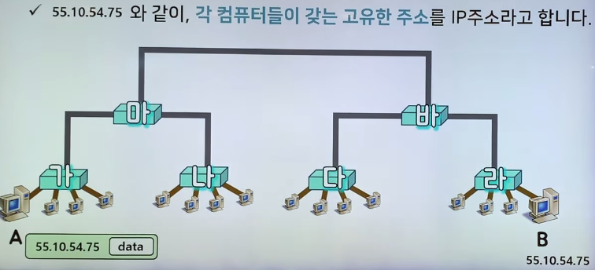

# OSI 7Layer

---

# 1계층 - Physical Layer

- 0과 1의 나열을 아날로그 신호로 바꾸어 전선으로 흘려보내고(encoding)

- 아날로그 신호가 들어오면 이를 0과 1의 나열로 해석하여(decoding)

- 물리적으로 연결된 두 대의 컴퓨터가 0과 1의 나열을 주고받을 수 있게 해주는 모듈(module)을 피지컬 레이어라고 부름.

- 1계층 모듈은 하드웨어적으로 구현되어 있다.( 하드웨어도 Input을 받아 output을 만들어내기 때문)

# 2계층 - Data Link Layer

같은 네트워크에 있는 여러 대의 컴퓨터들이 데이터를 주고받기 위해서 필요한 모듈

Framing을 사용하는데 이게 Data-Link-Layer 에 속하는 작업들 중 하나이다.

데이터를 보내는 과정을 글로 풀어보자면

1. 데이터를 보내는 컴퓨터에서 data를 2계층 encoder에서 input으로 들어가고 이 자료는 `1111 data 0000` 과 같은 형태로 프레임화 되어 인코딩되서 나오고

2. 이것이 1계층 encoder를 거치면 파형의 형태로 전환되고 전선으로 들어간다.

3. 전선을 거쳐서 데이터를 받는 컴퓨터의 1계층 decoder에서 파형의 형태를 프레임 화된 `1111 data 0000` 형태로 디코딩하고 이를 2계층 decoder에 입력하고 다시한번 decoding한 후에 data만 반환한다.

2계층도 주로 램카드에 구현되어있다.(하드웨어 적으로 구현되있음)

# 3계층 - Network Layer

55.10.54.75와 같이 , 각 컴퓨터들이 갖는 고유한 주소값을 `IP주소`라고 한다.

A가 B에게 데이터를 보내기 위해선 B의 주소를 알아야 한다.

예를 들어 B가 네이버에 있는 한 컴퓨터라고 생각해보자.

우리가 주소창에 www.naver.com이라고 치면 이 영어주소는 IP 주소로 변환되어 사용된다. -> 이 과정을 DNS라고 부른다.

이는 우리가 IP 주소를 알고 쓰는 것과 마찬가지인 셈이다.

`A 55.10.54.75 data`의 구조를 패킷이라고 부른다. 
이 A가 라우터 가로 이동한다.

이때 라우터 가에 연결된 컴퓨터중에 목표 IP주소를 갖는 컴퓨터가 없을 경우 라우터 가는 해당 패킷(A)를 라우터 마에게 전달한다.

라우터 마에 패킷이 도착하는 경우 라우터 마는 패킷을 가에게 줘야할지 나에게 줘야할지 바로줘야할지 모른다.

그러나 라우팅(어떠한 방법)에 의해 B에게 데이터를 보내려면 일단 바에게 줘야 한다는 것을 찾았다고 가정하자.

그러면 라우터 마는 데이터를 다시 포장해서 패킷의 형태(`A 55.10.54.75 data`)로 라우터 바로 보내고 라우터 바는 동일한 방식으로 라우터 라로 패킷을 보낸다.

라우터 라는 자신과 연결된 컴퓨터에 `A 55.10.54.75 data`에 해당하는 ip가 있는지 확인하고 해당 컴퓨터로 패킷을 보낸다.

결국 수많은 네트워크의 연결로 이루어지는 inter-Network 속에서 어딘가에 있는 목적지 컴퓨터로 데이터를 전송하기 위해 IP주소를 이용해 길을 찾고(routing) 자신 다음의 라우터에 데이터를 넘겨주는 것(forwarding)이다.

Network Layer는 운영체제의 `커널`에 소프트웨어적으로 구현되어 있다.