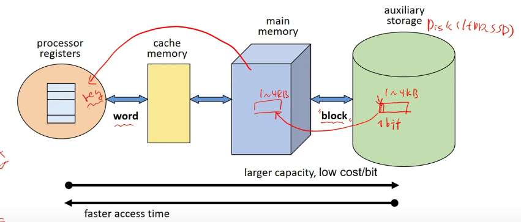
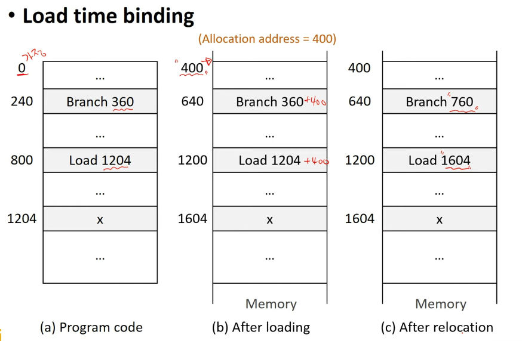
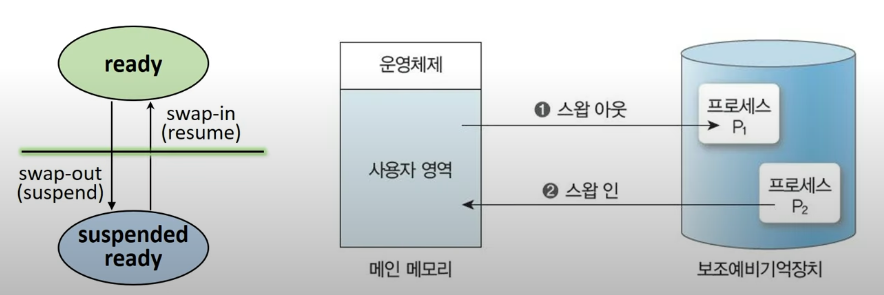
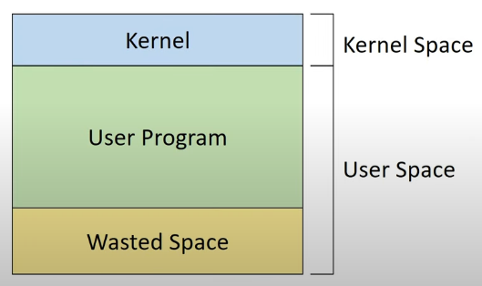
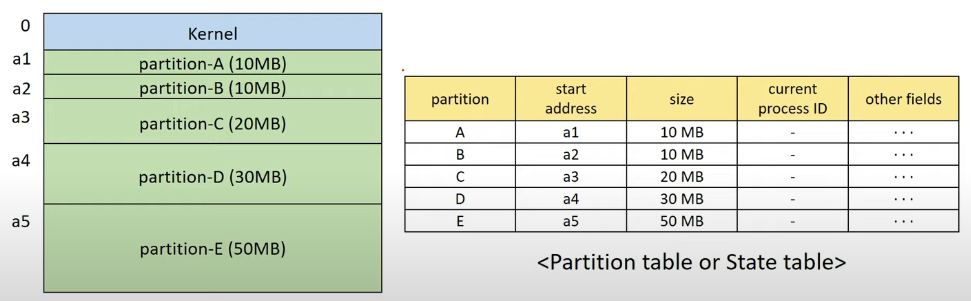
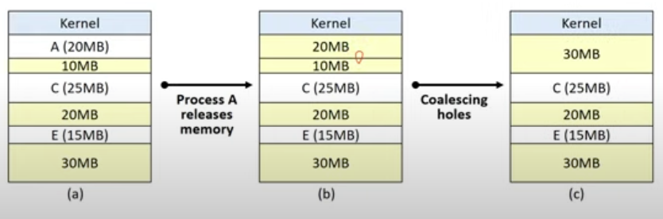
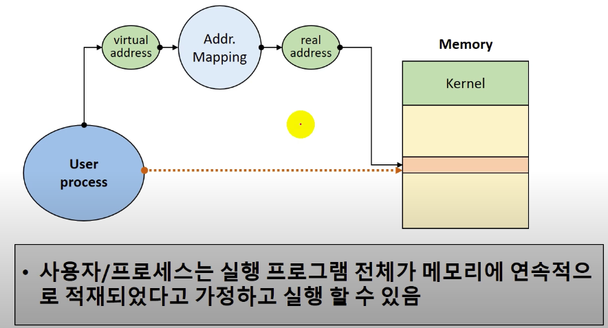
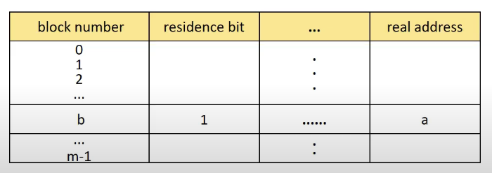
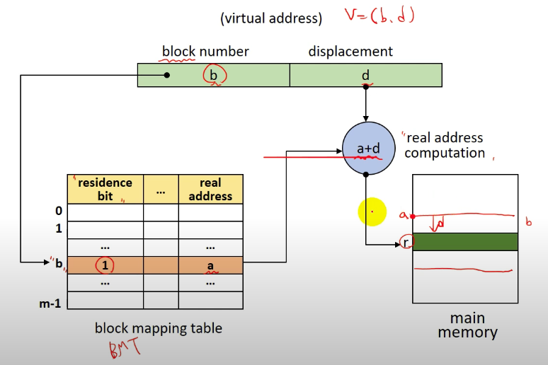

# HCP Lap - OS Lecture

# Memory Management

캐시, 레지스터 -> 하드웨어가 관리

메인메모리, 보조기억장치 등 -> 소프트웨어(OS 등등)가 관리

디스크에서 메모리로 데이터를 올리는 최소 단위는 `Block`이라고 부른다.

> Block

    보조 기억 장치와 주기억장치 사이의 데이터 전송 단위를 의미한다.
    size : 1 ~ 4 KB

> Word

    주기억장치와 레지스터 사이의 데이터 전송 단위를 의미한다.
    size : 16 ~ 64bit
    CPU 프로세스 단위만큼 읽는다.(32bit 운영체제의 경우 32bit 씩)

# Address Binding

Ring binder처럼 address를 묶는다는 의미로 프로그램의 논리 주소를 실제 메모리의 물리 주소로 매핑(mapping)하는 작업을 의미한다.

ex ) int a;가 있으면 이를 물리주소의 특정 위치에 저장하는것.

## Binding 시점에 따른 구분

- Compile time binding : 컴파일할때 바인딩
- Load time binding : 프로그램을 메모리에 올릴 때 바인딩
- Run time binding : 실행할때 바인딩

### Compile time binding : 컴파일할때 바인딩

1.  프로세스가 메모리에 적재될 위치를 컴파일러가 알 수 있는 경우에 해당함 ( 위치가 변하지 않아햐 한다.)

2.  프로그램 전체가 메모리에 올라가야 한다.

        ex) int a; int b; 가 각각 100번, 200번에 위치해야 한다고 가정하면 컴파일러가 이 메모리에 대해 완벽하게 이해하고 있어야 한다.

        만약 100번이 없다거나 200번의 위치에 다른게 있을 수도 있기 때문에 이 위치가 변하지 않아야 하고 이 프로그램들 전체가 올라가야 한다고 정해놨기 때문에 메모리에 올라가야 한다.

### Load time binding

1. 메모리 적재 위치를 컴파일 시점에서 모르면, 대체 가능한 상대 주소를 생성

   ex ) v + 100, v + 200등과 같은 주소를 상대 주소라고 함.

2. 적재 시점(load time)에 시작 주소를 반영하여 사용자 코드 상의 주소를 재설정

3. 프로그램 전체가 메모리에 올라가야 한다.

### Run-time binding

1. Address binding 을 수행시간까지 연기

   - 프로세스가 수행 도중 다른 메모리 위치로 이동할 수 있다.

2. HW의 도움이 필요하다.

   - MMU : Memory Management Unit

3. 대부분의 OS가 사용하는 방식

## Dynamic Loading

- 모든 루틴을 교체 가능한 형태로 디스크에 저장하는 방식
- 실체 호출 전까지는 루틴을 적재하지 않는다.
  - 메인 프로그램만 메모리에 적재하여 수행하는 방식
  - 루틴의 호출 시점에 address binding 수행하는 방식

* 장점
  - 메모리 공간의 효율적 사용

## Swapping

- 프로세서 할당이 끝나고 수행 완료된 프로세스는 swap-device로 보내고 (Swap-out)
- 새롭게 시작하는 프로세스는 메모리에 적재하는 방식(Swap-in)

# Memory Allocation

## Continuous Memory Allocation (연속할당)

- 프로세스(context)를 하나의 연속된 메모리 공간에 할당하는 정책

  - 프로그램, 데이터, 스택 등이 해당함.

- 메모리 구성 정책
  - 메모리에 동시에 올라갈 수 있는 프로세스의 수를 정한다.
    - Multiprogramming degree
  - 각 프로세스에게 할당되는 메모리 공간 크기
  - 메모리 분할 방법

> Uni(하나)-programming
> Multiprogramming degree = 1 -> 하나의 프로그램만 사용하는 방식

하나의 프로세스만 메모리 상에 존재하는 방법

가장 간단한 메모리 관리 기법이다.

- 문제점
  - 프로그램의 크기 > 메모리의 크기 인경우.
- 해결법

  - Overay structure
    - 메모리에 현재 필요한 영역만 적재하는 방법.
    - 문제는 사용자가 프로그램의 흐름 및 자료구조를 완벽하게 전부 파악하고 있어야 사용가능한 기법이다.

- 문제점

  - 커널 영역을 침범할 가능성이 생긴다.

- 해결법
  - 경계 레지스터(boundary register) 사용
    - Kernel 영역의 경계값 주소를 기억하고 User program이 이에 접근하지 못하도록 하는 방법.

> Multi-programming

- Fixed partition(FPM)
- Variable partition(VPM)

두 가지 방식으로 나뉜다.

## Fixed Partition Multiprogramming

- 메모리 공간을 미리 고정된 크기로 분할 시키는 방법
  - 미리 분할되어 있다.
- 각 프로세스는 하나의 partition(분할)에 적재한다.
  - prcess : partition 과 1:1로 대응된다.
- partition의 수 = K
  - Multiprogramming degree = K가 된다.

- 자료구조 형태

커널 영역 및 사용자 영역을 보호하는 방식은 똑같이 Boundary address를 사용한다.

## Fragmentation (단편화)

- Internal fragmentation (내부 단편화)

  - Partition의 크기보다 > process의 크기가 더 작은 경우
    - 메모리가 낭비된다.

- External fragmentation (외부 단편화)

  - 남은 메모리의 총량 > process 크기지만 연속된 공간이 아니라 할당할 수 없는 경우
    - 똑같이 메모리가 낭비된다.

- Fixed Partition Multiprogramming 요약
  - 고정된 크기로 메모리를 미리 분할해둔다.
  - 메모리 관리가 간편해진다.
    - low overhead를 갖게된다.
  - Internal / External fragmentation이 발생된다.
  - 단편화로 인해 시스템 자원이 낭비 될 수 있다.

## Variable Partition Multiprogramming

초기에는 전체가 하나의 영역으로 간주된다.

프로세스가 들어오면 프로세스를 처리하는 과정에서 메모리 공간을 동적으로 분할한다.

필요할 때마다 필요한만큼 공간을 분할하기 떄문에 내부단편화가 발생하지 않는다.

> 배치전략(Placement strategies)

First-fit(최초 적합)

- 충분한 크기를 갖는 첫 번째 partition을 선택하는 방식
- simple and low overhead
- 공간 활용률이 떨어질 수 있다.

Best-fit(최적 적합)

- Process가 들어갈 수 있는 partition 중 가장 작은 곳 선택하는 방식
- 탐색시간이 오래걸린다 -> overhead가 크다
  - 모든 partition을 살펴봐야 함
- 크기가 큰 partition을 유지 가능하다(장점)
- 작은 크기의 partition이 너무 많이 생겨 활용도가 낮아질 수 있다.(단점)

Worst-fit(최악 조합)

- process가 들어갈 수 있는 partition중 가장 큰 곳 선택하는 방식.
- 모든 partition을 살펴봐야 해서 오래걸린다.
- 작은 크기의 partition 발생을 줄일 수 있다.
- 그러나 큰 크기의 partition 화보가 어렵다.

Next-fit(순차 최초 적합)

- First fit(최초 적합)과 방법이 매우 유사하다.
- state table에서 마지막으로 탐색한 위치부터 탐색하는 방식
- 메모리 영역의 사용 빈도 균등화
- Low overhead를 갖는다.

### External fragmentation issue

> Coalescing holes (공간 통합)

- 인접한 빈 영역을 하나의 partition으로 통합하는 방식
  - process가 memory를 release하고 나가면 수행한다.
  - Low overhead를 갖는다.

> Storage Compaction (메모리 압축)

- 모든 빈 공간을 하나로 통합시킨다.
- 프로세스 처리에 필요한 적재 공간 확보가 필요할 때 사용한다.

문제는 high overhead를 갖는다.

- 모든 process를 중지시킨 상태에서 재배치해야 한다.
- 이는 많은 시스템 자원을 소비시킨다.

> 팁
> new나 malloc등의 동적 연산은 매우 비싼 연산에 해당된다. 100만번쯤 하면 대충 감이온다. 그렇기때문에 우리는 Memory pool이라는 걸 만들어서 사용한다.

커다란 메모리 공간을 만들어 놓고 여기서 데이터를 퍼다가 사용하는 방식이다.

예를 들어 일단 우리가 1GB가 필요하면 OS로부터 1GB를 할당받고 시작한다. 그 후 어떤 프로세스가 어떤 정도로 메모리가 필요하다면 그것을 Memory pool에서 데이터를 할당하고 반환받는 편이 훨씬 빠르다.

# Virtual Storage(Memory)

- Non-continuous allocation
- 사용자 프로그램을 여러 개의 block으로 분할한 후에 메모리에 올린다.
- 실행 시, 필요한 block들만 메모리에 적재한다.

  - 나머지 block들은 swap device에 존재시킨다.

- 기법들
  - Paging system
  - Segmentation system
  - Hybrid Paging/Segmentation system

# Non-continuous Memory Allocation (비연속할당)

- Virtual address(가상 주소) = relative address
  - Logical address(논리 주소)
  - 연속된 메모리 할당을 가정한 주소
- Real address(실제 주소) = absolute (Physical)

  - 실제 메모리에 적재된 주소

- Address mapping
  - Virtual address -> real address

사용자 프로그램을 block 단위로 분할 / 관리 되고 있다.

- 각 block에 대한 address mapping 정보를 유지한다.

Virtual address : v = (b,d)

- b : 블록의넘버
- d : 시작점으로부터 얼마만큼 떨어져 있는가(offset)

이런 것들이 어떻게 관리가 될까?

이러한 것들을 관리하기 위해 `Block map table(BMT)`를 사용한다.

> Block map table(BMT)

Address mapping 정보 관리

- Kernel 공간에 프로세스마다 하나의 BMT를 가진다.

Residence bit : 해당 블로이 메모리에 적재되었는지를 판단하는 값 (0 - False , 1 - True)

BMT 사용 블록 매핑 예제

V = (b,d)일 때
  
