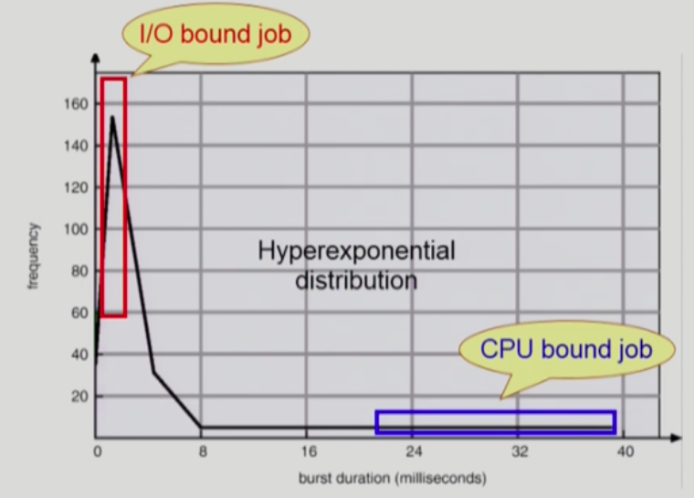

# 운영체제(Operating System, OS) 란?

컴퓨터 하드웨어 바로 위에 설치되어 사용자 및 다른 모든 소프트웨어와 하드웨어를 연결하는 소프트웨어 계층을 의미한다.


하드웨어는 운영체제가 설치되어있지 않으면 고철덩이에 불과하다.

하드웨어에 운영체제를 설치하는 순간 하나의 컴퓨터 시스템이 되고 다른 소프트웨어들도 운영체제의 관리를 받으며 실행된다.

- 좁은 의미의 운영체제(커널)
  전원을 켠다음에 부팅이 일어난 이후로 메모리에 항상 상주하는 부분을 의미한다.
  전공생 입장에서 주로 운영체제란 커널을 의미함

- 넓은 의미의 운영체제
  커널을 포함한 각종 주변 시스템 유틸리티를 포함한 개념
  메모리에 상주하지않는 별도의 독립적인 프로그램들을 의미하기도 함
  ex) 파일 복사(하나의 소프트웨어 프로그램)하는 것등을 포함

하드웨어에는 크게 세 가지 분류가 있다.

1. 프로세서 : 계산하는 장치 (CPU, GPU 등)

2. 메모리 : 저장하는 장치

3. 주변장치 : 키보드, 모니터 등의 IO장치, 네트워크 장치

## 1.프로세서(Processor)

연산을 수행하는 장치

컴퓨터의 모든 장치의 동작 제어


> 레지스터

무언가를 저장하는 장치인데 프로세서 내부에 있는 메모리

프로세서가 사용할 데이터를 저장한다.

컴퓨터에서 가장 빠른 메모리 (대신 용량이 적다)

> 레지스터의 종류

- 용도에 따른 분류 : 전용 레지스터 (목적이 있음), 범용 레지스터

- 변경 가능에 따른 분류 : 사용자 가시 레지스터, 사용자 불가시 레지스터

- 저장하는 정보의 종류에 따른 분류 : 데이터 레지스터, 주소 레지스터, 상태 레지스터

### 사용자 가시 레지스터

- 데이터 레지스터 : 데이터를 저장한다
- 주소 레지스터 : 주소를 저장한다

ex) C언어에서 변수 앞에 register를 입력하는 것은 해당 변수를 레지스터에 저장할 수 있도록 하는 구문이다.

### 사용자 불가시 레지스터

- 프로그램 카운터 : 실행할 명령어의 주소를 보관하는 레지스터
- 명령어 레지스터 : 현재 실행하는 명령어를 보관하는 레지스터
- 누산기 : 데이터를 일시적으로 저장하는 레지스터(계산에 필요한 레지스터)

## 운영체제와 프로세서의 관계

- 운영체제의 역할 중 프로세서의 관리또한 포함되어 잇다.
- 프로세서에게 처리할 작업 할당 및 관리
  - 프로세스(process) 생성 및 관리
- 프로그램의 프로세서 사용 제어
  - 프로그램의 프로세서 사용 시간 꽌리
  - 복수 프로그램간 사용 시간 조율

## 메모리(Memory)

한마디로 데이터를 저장하는 장치(기억장치)
프로그램(OS, 사용자SW 등), 사용자 데이터 등을 저장


## 운영체제의 목표

1. 컴퓨터 시스템을 편리하게 사용할 수 있는 환경을 제공한다.

   - 운영체제는 동시 사용자 / 프로그램들이 각각 독자적 컴퓨터에서 수행되는 것 같은 환상을 제공한다.
   - 하드웨어를 직접 다루는 복잡한 부분을 운영체제가 대행한다.


2. 컴퓨터 시스템의 `자원(resource)을 효율적으로 관리`한다.
   - 프로세서, 기억장치, 입출력 장치등을 효율적으로 관리한다.
     - 사용자간의 형평성 있는 자원 분배
     - 주어진 자원으로 최대한의 성능을 내도록 하는 것
     - 가장 중요한 목적이자 목표
   - 사용자 및 운영체제 자신의 보호
   - 프로세스, 파일, 메시지 등을 관리


여러 프로그램이 동시에 실행된다면 CPU에서 짧은 시간 간격으로 번갈아가면서 받는다.

또한 메인 메모리가 하나 통째로 주어지는데 이 메모리를 쪼개서 프로그램들이 올라가있다.

각 프로그램들이 얼마만큼의 메모리를 갖게 하는지 쪼개주는 역할을 OS(운영체젬)가 담당한다.

# 운영 체제의 분류

## 동시 작업 가능 여부

- 단일 작업(single tasking)

  한 번에 하나의 작업만 처리

  ex) MS-DOS 프롬프트 상에서는 한 명령의 수행을 끝내기 전에 다른 명령을 수행시킬 수 없음

- 다중 작업(multi tasking)

  동시에 두 개 이상의 작업 처리
  현대의 대부분 운영체제가 가지는 형태

  ex) UNIX, MS Windows 등에서는 한 명령의 수행이 끝나기 전에 다른 명령이나 프로그램을 수행할 수 있음

## 사용자의 수

단일 사용자만 지원하는 운영 체제가 있고, 다중 사용자를 지원하는 운영 체제가 있다.

- 단일 사용자(single User)

  ex) MS-DOS, MS Windows

- 다중 사용자(multi User)

  ex) UNIX, NT server

## 처리 방식

### 1. 일괄 처리(batch processing)

- 작업 요청의 일정량을 모아서 한꺼번에 처리(현대에는 잘 쓰이지 않음)
- 작업이 완전 종료될 떄 까지 기다려야 하는 방식
- Interactive 하지 않음.

### 2. 시분할(time sharing)

- 여러 작업을 수행할 때 컴퓨터 처리 능력을 일정한 시간 단위로 분할하여 사용(CPU)
- 일괄 처리 시스템에 비해 짧은 응답 시간을 가짐.
- 주어진 자원을 최대한 활용하는 것이 주 목적인( 정확한 시간을 지켜주거나 그러진 않음) 사람이 목적인 시스템
- Interactive한 방식(응답이 바로바로 나오는)

### 실시간(Realtime OS)

- 데드라인이 존재해서 정해진 시간 안에 어떠한 일이 반드시 보장되어야 하는 실시간 시스템을 위한 OS

  ex) 원자로/공장 제어, 미사일 시스템 제어, 반도체 장비, 로보트 제어

- 실시간 시스템의 개념 확장

  - Hard realtime system(경성 실시간 시스템)

    주로 다루지 않는 시스템

  - Soft realtime system(연성 실시간 시스템)

    리눅스, 윈도우, IOS등이 있음.

# 운영체제의 예

## UNIX

- 대형 컴퓨터를 위해 만들어진 운영 체제
- 코드의 대부분을 C언어(Unix를 만들기 위해 만들어진 언어)로 작성되었음.
- 높은 이식성
- 커널 코드가 대부분 C로 구성되어 있음
- 복잡한 시스템에 맞게 확장이 용이하다.
- 소스 코드 공개되있음
- 프로그램 개발에 용이함
- 다양한 버전 존재

  - System V, FreeBSD, SunOS, Solaris
  - Linux(현재 메인으로 사용되는 운영체제)

## DOS(Disk Operating System)

- MS사에서 1981년 IMB-PC를 위해 개발
- 단일 사용자용 운영체제, 메모리 관리 능력의 한계(주 기억 장치 : 640kb)

## Window

- MS에서 개인용으로 만든 운영 체제
- Plung and Play, 네트워크 환경 강화
- DOS용 응용 프로그램과 호환성 제공
- 불안정성( 현재는 많이 개선됨)
- 풍부한 지원 소프트웨어

# 운영 체제의 구조


- CPU 스케쥴링

  시간차이를 완충해주면서 자원의 특성을 최대한 활용하기 위한 방식. 순서대로 처리하지 않음.

- 메모리 관리

  메모리는 한정되어있다. 이 경우 어떤 프로그램에 얼만큼 할당해야하는가? 에 대한 고민이 존재한다. 공평하게 분배하는것은 말이 안된다.

- 파일 관리

  디스크에 파일을 어떻게 보관하는가 또한 상당히 중요한 부분이다. 디스크 또한 스케쥴링이 필요하다.

- 입출력 관리

  I/O device와 어떻게 통신하고 데이터를 주고받을것인지를 정해야한다.

- 프로세스 관리

  프로세스의 생성, 삭제, 자원 할당 및 반환 등을 어떻게 할 것인가를 고려해야 한다.


CPU의 작업공간이 Memory인데 CPU는 매 순간마다 기계어를 하나씩 읽어서 프로그램을 실행한다.

HardDisk는 인풋,아웃풋 디바이스의 2가지 역할을 모두 수행함.

device controller가 각 I/O 디바이스를 전단ㅁ하여 컨트롤하는 CPU라고 볼 수 있다. 또한 작업공간이 필요하는데 이를 local buffer라고 부른다.

CPU와 I/O Device는 처리속도가 굉장히 차이가 난다(100만배정도) 또한 CPU는 매 클럭마다 인스트럭션을 하나씩 읽어서 실행하고 다음 인스트럭션을 또 읽어서 실행하고를 반복한다.

CPU안에는 메모리보다 더 빠르면서 정보를 저장할 수 있는 작은 공간인 레지스터(registers)가 존재한다.

또한 CPU에서 실행하는 것이 운영체제인지, 사용자 프로그램인지를 판단하여 구분해 주는 것이 mode bit이라는 부분이다.

Interrupt line은 왜 있는가? CPU는 메모리에 있는 instruction(기계어의 주소값)만을 처리한다. 한마디로 CPU는 Memory하고만 일을 한다. 만약 sacnf, printf 같은 키보드나 디스크에서 뭔가 처리한 정보들을 처리하기 위해선 Interrupt line이 존재한다.

예를 들어 scanf처럼 뭘 가져오거나 printf처럼 출력하려는 그런 입출력 instruction을 처리하려면 뭔가 해당 I/O device에게 일을 시키는 instruction이 존재 한다.

그렇게 일을 시키면 컨트롤러들은 지시를 받아 처리하겠지만 이 일은 굉장히 오래걸리고 그 동안 자신의 버퍼에 저장한다. 그런다음 해당 I/O 컨트롤러가 CPU에 인터럽트를 건다.

그 후 인터럽트가 걸리면 CPU는 동작을 멈추고 제어권을 OS에 넘긴다. OS는 이 인터럽트가 왜들어왔는지를 파악하여 해당 인터럽트가 요구하는 프로그램에 CPU 제어권을 부여한다.

다음으로 무한 루프를 도는 프로그램을 만들었다고 가정해보자.

이 경우 프로그램은 끝나지 않고 계속 CPU만을 사용하게 될 것이다. 그래서 이를 방지하기 위해 타이머(Timer)라는 하드웨어를 두고있다.

주 기능은 특정 프로그램이 CPU를 독점하지 못하도록 하는 역할을 가지고 있다.

사용자 프로그램은 타이머에 세팅된 시간만큼만 CPU를 독점하며, 세팅된 시간이 지나면 타이머(Timer)는 CPU에 인터럽트를 걸어준다.

인터럽트가 걸리면 CPU는 하던일을 멈추고 CPU의 제어권이 자동으로 프로그램에서 운영체제로 넘어간다.

운영체제가 CPU를 갖게되면 어떻게 되는가?

프로그램이 N개라면 이 N개의 프로그램을 타이머에 할당된 시간만큼 순회하면서 처리하게 될 것이다.

사용자 프로그램은 I/O 장치에 바로 접근할 수 없다.(보안등의 이유로)

I/O 작업이 필요하다면 무조건 운영체제를 거쳐서 진행된다.

<24:13 모드빗 설명>

## Mode bit

사용자 프로그램의 잘못된 수행으로 다른 프로그램 및 운영체제에 피해가 가지 않도록 하기 위한 보호 장치가 필요하다.

이를 방지 하기 위한 것이 `Mode bit`이고 이를 통해 하드웨어적으로 두 가지 모드의 operation을 지원한다.

- 1 사용자 모드 : 사용자 프로그램 수행
- 0 모니터 모드(커널 모드)\*: OS 코드의 수행

  - 보안을 해칠 수 있는 중요한 명령어는 모니터 모드에서만 수행 가능하다.
  - Interrupt나 Exception 발생시 하드웨어가 mode bit을 0으로 바꿈
  - 사용자 프로그램에게 CPU를 넘기기 전에 mode bit을 1로 셋팅

Mode bit이 0일 때(즉 운영체제가 CPU에서 실행중일 때)에는 아무거나 실행이 가능하다. 때문에 I/O 디바이스에 접근하는 instruction또한 실행시킬 수 있다.

그러나 1일 때에는 프로그램을 수행중이기 때문에 I/O에 접근하는 instruction은 실행이 불가능하다.

## Timer

타이머

- 정해진 시간이 흐른 뒤 운영체제에게 제어권이 넘어가도록 인터럽트를 발생시킨다.
- 타이머는 매 클럭 틱 때마다 1씩 감소한다
- 타이머 값이 0이 되면 타이머 인터럽트가 발생한다.
- CPU를 특정 프로그램이 독점하는 것으로부터 보호한다.

타이머는 time sharing을 위해 구현되었다.

## Device Controller

하드웨어 중 하나이다.

- I/O장치를 관리하기위한 작은 CPU장치이다.
- 제어 정보를 위해 control register, status register를 가진다.
- local buffer라는 일종의 data register를 가진다.

- I/O는 실제 device와 local buffer 사이에서 일어난다.

## DMA Controller

원래 메모리에 접근할 수 있는 장치는 CPU 뿐이었는데 DMA Controller를 사용하면 DMA또한 접근이 가능하다.

Memory controller는 이 두 장치 사이의 교통정리를 진행하는 역할을 한다.

DMA의 역할은 I/O 장치가 너무 인터럽트를 많이 걸기 때문에 CPU가 이 인터럽트 내용을 카피하게 하는 것은 오버헤드가 너무 크다.

그렇기 떄문에 CPU는 자기일을 지속적으로 하고 중간에 로컬버퍼에 들어오는 내용을 DMA가 메모리에 직접 복사까지하고 이 것을 CPU에 보고를 직접하게 되면 CPU에 인터럽트 걸리는 비중을 줄일 수 있기 때문에 사용한다.

## I/O(입출력)의 수행

- 모든 입출력 명령은 특권 명령에 해당된다.

- 사용자 프로그램은 그럼 어떻게 I/O를 요청하는가?
  - 시스템콜(system call)
    - 사용자 프로그램이 운영체제의 커널 함수를 요청하여 I/O를 요청하는 것
  - trap을 사용하여 인터럽트 벡터의 특정 위치로 이동한다.
  - 제어권이 인터럽트 벡터가 가리키는 인터럽트 서비스 루틴으로 이동한다.
  - 올바른 I/O 요청인지 확인 후 I/O를 수행한다. (권한이 있는지 아닌지 확인함 )
  - I/O 완료 시 제어권을 시스템콜 다음 명령으로 옮긴다. ( 하드웨어로 옮기는 것 )

프로그램또한 디바이스 컨트롤러나, 타이머처럼 CPU에 인터럽트를 소프트웨어적으로 걸 수 있다.

## 인터럽트(Interrupt)

- 인터럽트

  - 인터럽트 당한 시점의 레지스터와 program counter를 save한 후에 CPU의 제어를 인터럽트 처리 루틴에 넘긴다.

- Interrupt(넓은 의미)

  - Interrupt (하드웨어 인터럽트) : 하드웨어가 발생시킨 인터럽트 -> 일반적인 의미의 인터럽트를 의미함.
  - Trap (= 소프트웨어 인터럽트)
    - Exception : 프로그램이 오류를 범한 경우
    - System call : 프로그램이 커널 함수를 호출하는 경우

인터럽트의 종류가 여러개이고 각각의 인터럽트마다 해야할 일이 다르다. 이 해야 할 일등을 기록하는 것이 처리 루틴이고, 그 주소를 기록한 것이 인터럽트 벡터이다.

- 인터럽트 관련 용어
  - 인터럽트 벡터
    - 해당 인터럽트의 처리 루틴 주소를 가지고 있음
  - 인터럽트 처리 루틴 ( = Interrupt Service Routine, 인터럽트 핸들러)
    - 해당 인터럽트를 처리하는 커널 함수

현대의 운영체제는 인터럽트에 의해 구동된다.

## 동기식 입출력과 비동기식 입출력

- 동기식 입출력(synchronous I/O)

  - I/O 요청 후 입출력 작업이 완료된 후에야 제어가 사용자 프로그램에게 넘어간다.
  - 구현 방법 1
    - I/O가 끝날 때까지 CPU를 낭비시킴
    - 매 시점 하나의 I/O만 일어날 수 있음
  - 구현 방법 2
    - I/O가 완료될 때까지 해당 프로그램에게서 CPU를 빼앗음
    - I/O 처리를 기다리는 줄에 그 프로그램을 줄 세운다.
    - 다른 프로그램에게 CPU를 준다.

- 비동기식 입출력(asynchronous I/O)
  - I/O가 시작된 후 입출력 작업이 끝나기를 기다리지 않고 제어가 사용자 프로그램에 즉시 넘어감

## DMA(Direct Memory Access)

DMA도 메모리에 다이렉트로 연결할 수 있다.

- 빠른 입출력 장치를 메모리에 가까운 속도로 처리하기 위해 사용
- CPU의 중재 없이 device controller가 device의 buffer storage의 내용을 메모리에 block 단위로 직접 전송
- 바이트 단위가 아니라 block 단위로 인터럽트를 발생시킴.

# 서로 다른 입출력 명령어

우리가 CPU에서 실행할 수 있는 기계어(instruction)에는 2가지 방법이 있다.

1. 메모리에 접근하는 instruction과 메모리에 접근하는 instruction 2가지로 나뉜 방법 ( 일반적인 케이스 )

2. I/O 디바이스에 메모리 주소를 매겨서 메모리 접근하는 instruction 1가지로 하는 방법 -> Memory Mapped I/O 라고 부르는 방법


---

# 저장장치 계층 구조


위로 갈수록 가격이 비싸고 속도가 빠르다는 특징이 있다.

캐슁 - > 재사용을 목적으로 사용.

# 프로그램의 실행

프로그램이란 어떻게 실행되는가?

프로그램이란 보통 실행파일 형태로 디스크에, 파일 시스템에선 파일 형태로 저장되어 있다.


바로 파일시스템에서 피지컬 메모리의 영역으로 가는게 아니라 한단계의 과정을 거쳐서 실행된다.

바로 가상메모리 단계이다. 어떤 프로그램을 실행시키면 어떤 프로그램의 독자적인 주소 공간이 생긴다.(ex = 프로세스 A or B의 Address space)

stack구조로 되어 있는 이유는 코드가 함수의 형태로 되어있기 때문에 함수를 호출하거나 꺼냈을때 데이터를 저장해두기 위한 용도이다.

모든 프로그램은 이러한 독자적인 주소공간을 가지고 있고, 물리주소와 연결되어 있다.

그러나 물리적인 주소에 해당 메모리를 통째로 올려두는 것은 낭비이고 비효율적 이다.

# 커널 주소 공간의 내용


# 사용자 프로그램이 사용하는 함수

- 사용자 정의 함수

  - 자신의 프로그램에서 정으한 함수

- 라이브러리 함수(내가 직접 작성한게 아닌 함수)

  - 자신의 프로그램에서 정의하지 않고 갖다 쓴 함수
  - 자신의 프로그램 실행 파일에 포함되어 있다.

- 커널 함수
  - 운영체제 프로그램의 함수
  - 커널 함수의 호출 = 시스템 콜

---

# 프로세스

## 프로세스의 상태도


## 프로세스의 개념

"Process is a program in excution"

"프로세스는 실행중인 프로그램이다"

- 프로세스의 문맥(context)
  - CPU 수행 상태를 나타내는 하드웨어 문맥
    - Program Counter (PC)
    - 각종 register
  - 프로세스의 주소 공간(프로세스가 실행되면 주소 공간 생성) 메모리와 관련된 부분
    - code, data, stack
  - 프로세스의 관련 커널 자료 구조
    - PCB(Process Control Block)
    - Kernel stack


특정 시점을 놓고 봤을때 프로세스는 독자적인 주소 공간을 만든다. 이 주소 공간은 stack, data, code로 구성되는 구조를 가지고 있고,

이 프로세스가 CPU를 잡게되면 Program Counter라는 레지스터가 이 코드의 어느부분을 가르키고 있고, 매 순간 이 code에서 기계어(instruction)을 하나씩 읽고, CPU안의 레지스터에 불러와서 산술 연산장치(ALU)를 거쳐 값을 하나씩(R1,R2~~Rn) 저장하거나 바깥 메모리에 저장하거나 하고 있다.

그렇기 때문에 프로세스의 문맥을 파악하기 위해선 Program Counter가 어디를 가르키는가를 알아야하고, 어떤 내용을 data(변수값등)을 어떻게 가지고 있는가를 알아야 한다.

### Kernel stack

프로세스가 실행되다가 자신이 할수 없는 일을 만나면 시스템에 요청하는데 이를 system call(시스템 콜)이라고 부른다.

시스템 콜을 부르면 커널 주소공간을 부르게 된다. 커널 또한 함수들로 이루어져 있다. 커널은 여러 프로세스들이 공유하는 공간이라고 할 수 있다. 커널에서 함수호출이 이루어져 스택에 함수를 쌓게되면 커널의 스택은 각 함수의 커널 스택을 별도로 만들어서 쌓아두게 된다.

## 프로세스의 상태(Process State)

프로세스는 상태(state)가 변경되며 수행된다.

- Running
  - CPU를 잡고 Instruction을 수행중인 상태
- Ready
  - CPU를 기다리는 상태(메모리 등 다른 조건을 모두 만족한 상태로)
- Blocked(wait, sleep)

  - CPU를 주어도 당장 instruction을 수행할 수 없는 상태
  - Process 자신이 요청한 event(예:I/O)가 즉시 만족되지 않아 이를 기다리는 상태
  - 예) 디스크에서 file을 읽어와야 하는 경우

- Suspended (stopped)

  - 외부적인 이유로 프로세스의 수행이 정지된 상태
  - 프로세스는 통째로 디스크에 swap out 된다.
  - 예 ) 사용자가 프로그램을 일시 정지 시킨 경우
    or 시스템이 여러 이유로 프로세스를 잠시 중단 시킨 경우

- New : 프로세스가 생성중인 상태
- Terminated : 수행(execution)이 끝난 상태


# Process Control Block(PCB)

운영체제가 각 프로세스를 관리하기 위해 프로세스당 유지하는 정보

다음의 구성요소를 가진다( 구조체로 되어있음 )

- 1)OS가 관리상 사용하는 정보

  - Process state, Process ID
  - sheduling information, priority

- 2)CPU 수행 관련 하드웨어 값

  - Program Counter, registers

- 3)메모리 관련

  - Code, data, stack의 위치 정보

- 4)파일 관련
  - Open file descriptors...


# 문맥 교환 (Context Switch)

- CPU를 한 프로세스에서 다른 프로세스로 넘겨주는 과정
- CPU가 다른 프로세스에게 넘어갈 때 운영체제는 다음을 수행한다.
  - CPU를 내어주는 프로세스의 상태를 그 프로세스의 PCB에 저장
  - CPU를 새롭게 얻는 프로세스의 상태를 PCB에서 읽어온다.

인터럽트가 들어왔을 때 다른 프로세스를 진행하기 위해 현재 레지스터에 등로되있는 프로세스의 진행상태 정보를 기존 프로세스의 PCB(data)에 저장하게 된다.


시스템 콜이나 인터럽트 발생시 반드시 문맥교환이 일어나는 것은 아니다.

사용자 프로세스 A -> 커널 모드 -> 사용자 프로세스 A 와같은 교환은 문맥교환이 이뤄진다고 보기 힘들다. 이 경우는 유저모드 -> 커널모드 -> 유저모드의 변환이다.

반면

사용자 프로세스 A -> 커널 모드 -> 사용자 프로세스 B와 같은 경우에는 문맥 교환이 발생한 것이다.

# 스케쥴러(Scheduler)

- Long-term scheduler(장기 스케쥴러 or job scheduler)

  - 시작 프로세스 중 어떤 것들을 reqdy queue에 보낼지 결정
  - 프로세스에 memory(및 각종 자원)을 주는 문제
  - degree of Multiprogramming을 제어
    - 메모리에 프로그램이 여러개 올라가있는 것을 의미
  - time sharing system에는 보통 장기 스케쥴러가 없다. (무조건 ready)

- Short-term scheduler(단기 스케쥴러 or CPU scheduler)

  - 어떤 프로세스를 다음번에 running 시킬지 결정
  - 프로세스에 CPU를 주는 문제
  - 충분히 빨라야 한다(ms 단위)
    ₩

- Medium-Term scheduler(중기 스케쥴러 or Swapper)
  - 여유 공간 마련을 위해 프로세스를 통째로 메모리에서 디스크로 쫓아낸다.
  - 프로세스에게서 memory를 뺏는 문제
  - degree of Multiprogramming을 제어.

## 프로세스의 상태도(Suspended 추가)


---

# Thread(쓰레드)

"A thread ( or lightweight process) is a basic unit of CPU utilization"

- Thread의 구성

  - program counter
  - register set
  - stack space

- Thread가 동료 thread와 공유하는 부분(=task)

  - code section
  - data section
  - OS resources

- 전통적인 개념의 heavyweight process는 하나의 thread를 가지고 있는 task로 볼 수 있다.


 
쓰레드 라는 것은 하나의 주소공간을 두고 프로그램 카운터만 여러개 두는 것을 의미한다. 프로세스 하나에 CPU 수행단위를 여러개 두는 것을 말한다.

공유할 수 있는 것은 최대한 공유한다.(주소공간, 쓰레드의 각종 자원들 또한 공유한다.)

서로 다른 별도인 부분은 각 주소공간의 stack, 쓰레드의 Program Counter, register등이다.

## 쓰레드 이용시의 장점

- 다중 스레드로 구성된 태스크 구조에서는 하나의 서버 스레드가 blocked (waiting) 상태인 동안에도 동일한 태스크 내의 다른 스레드가 실행(Running) 되어 빠른 처리를 할 수 있다.

- 동일한 일을 수행하는 다중 스레드가 협력하여 높은 처리율(throughput)과 성능 향상을 얻을 수 있다 (자원 절약이 가능)

- 스레드를 사용하면 병렬성을 높일 수 있다. (CPU가 여러개 달린 경우에 해당)

1. 응답성 - 사용자 입장에서 매우 빠르다. 하나의 쓰레드가 블록되도 나머지 쓰레드가 지속적으로 요청을 보내고 응답을 받아올 수 있기 때문

2. 자원 공유 - N개의 쓰레드는 하나의 코드, 데이터, 각종 자원들을 공유하기 때문

3. 경제성 - 프로세스를 하나 만드는 것은 오버헤드가 매우 크다. 그러나 스레드간의 CPU switching은 훨씬 오버헤드가 적다.

---

# 프로세스의 생성(Process Creation)

- COW(Copy On Write)

- 부모 프로세스(Parent process)가 자식 프로세스(children process) 생성한다.

- 프로세스의 트리(계층 구조) 형성
- 프로세스는 자원을 필요로 한다.
  - 자원은 보통 운영체제로부터 받는다
  - 자원은 부모와 공유할 수도 있다.
- 자원의 공유
  - 부모와 자식이 모든 자원을 공유하는 모델이다
  - 일부를 공유하는 모델이다
  - 전혀 공유하지 않는 모델(일반적인 모델)
- 수행 (Excution)
  - 부모와 자식은 공존하며 수행되는 모델
  - 자식이 종료(terminate)될 때까지 부모가 기다리는(wait) 모델

> 어떻게 생성하는가?

- 주소 공간(Address space)
  - fork로 우선 복제 -> exec으로 덮어쓰는 2단계 과정을 가짐.
  - 자식은 부모의 공간을 복사한다(binary and OS data)
  - 자식은 그 공간에 새로운 프로그램을 올린다.
- 유닉스의 예
  - fork() 라는 시스템 콜이 새로운 프로세스를 생성한다.
    - 부모를 그대로 복사한다.(OS data except PID + binary)
    - 주소 공간 할당
  - fork 다음에 이어지는 exec() 시스템 콜을 통해 새로운 프로그램을 메모리에 올린다.

복제하고 덮어씌우지 않을 수도 있고, 복제를 안하고 exec()만 할 수 도 있다.

# 프로세스의 종료(Process Termination)

프로세스가 마지막 명령을 수행한 후 운영체제에게 이를 알려준다(exit)

- 자식이 부모에게 어떠한 데이터를 보낸다.(via wait)
- 프로세스의 각종 자원들이 운영체제에게 반납된다.

비 자발적으로 프로세스가 종료되는 경우도 있다.(abort)

- 자식이 할당 자원의 한계치를 넘어가는 경우
- 자식에게 할당된 태스크가 더 이상 필요하지 않은 경우
- 부모가 종료(exit)하는 경우
  - 운영체제는 부모 프로세스가 종료하는 경우 자식이 더 이상 수행되도록 두지 않는다.
  - 단계적인 종료

COW -> Write가 일어났을때 Copy까지 진행한다.

## fork() 시스템 콜

프로세스는 fork()라는 시스템 콜에 의해 만들어진다.

- 새로운 주소 공간이 생성된다. 그것은 호출자의 복제품이다.

```c
int main()
{ int pid;
  pid = fork() // fork() 이부분이 시스템 콜에 해당한다.
  if (pid == 0) /* this is child */
    printf("\n Hello, i am child!\n");
  else if (pid >0) /* this is parent */
    printf("\n Hello, I am parent!\n");
}
```

부모 프로세스는 fork가 호출되면 똑같은 구조를 복사해내는데 이 때 자식 프로세스는 복제한 전문을 그대로 따라서 카피하는 것이 아니고(즉 main()의 시작부터 실행하지 않고) 시스템 콜 아랫부분부터 실행한다.

문제는 복제된 자식프로세스가 똑같이 원본임을 주장하게 된다.(같은 코드를 가지고 있기 때문)

이러한 문제를 막기위해 자식과 부모를 구분시켜준다. (위의 예제코드에서 PID값을 통해 구분)

fork를 실행하고나면 부모프로세스는 결과값이 양수가 나오고 자식프로세스는 fork의 결과값으로 0이라는 값을 받게된다.

# exec() 시스템콜

exec() 시스템콜은 프로그램의 이미지를 완전히 새로운 프로그램으로 바꿔준다.

```c
int main()
{ int pid;
  pid = fork()
  if (pid == 0)       /* this is child */
  {
    printf("\n Hello, i am child! Now i'll run date \n")
    execlp("/bin/date", "/bin/date", (char *) 0); // execlp가 exec함수를 호출하는 역할을 함.
    printf("\n Hello, I am parent!") // 이 함수는 실행될일이 없음. exec에 의해 다른함수로 내용이 바뀌기 때문
  }
  else if (pid >0)    /* this is parent */
    printf("\n Hello, I am parent!\n");
}
```

위의 예제코드에서는 execlp 함수를 만나면 이 함수가 exec() 시스템콜을 호출하는 역할을 한다.

## - execlp()

execlp의 경우 다음과 같은 형태를 가진다.

execlp("프로그램명","프로그램명",optional,optioanl,(cahr \*) 0)

프로그램명을 2번 적어주고, 전달해줄 인자들을 옵셔널로 넣어주고, 마지막으로 캐릭터 포인터 0를 써주면된다.

# wait() 시스템 콜

wait 시스템콜은 프로세스를 블록상태로 바꿔 잠들게 하는것이다.

프로세스 A가 wait() 시스템 콜을 호출하면 다음의 처리 과정을 가지게 된다.

- 커널은 child가 종료될 때까지 프로세스 A를 sleep 시킨다.(block 상태)
- Child process가 종료되면 커널은 프로세스 A를 깨운다(ready 상태)

wait 시스템콜은 뭘 블락시키면서 기다리는걸까? -> 보통 자식프로세스를 만들고 wait() 시스템콜을 부른다.

보통은 자식프로세스가 종료될때까지 기다린다.

# exit() 시스템 콜

exit() 시스템 콜은 프로세스를 종료시킬 때 호출하는 시스템 콜이다.

프로세스의 종료를 의미하는 시스템콜로써 2가지 케이스로 나뉜다.

- 자발적 종료

  - 마지막 statement 수행 후 exit() 시스템 콜을 통해 프로그램에 명시적으로 적어주지 않아도 main 함수가 리턴되는 위치에 컴파일러가 넣어준다.

- 비자발적 종료
  - 부모 프로세스가 자식 프로세스를 강제 종료 시키는 경우이다.
    - 자식프로세스가 한계치를 넘어서는 자원을 요청하는 경우
    - 자식에게 할당된 태스크가 더 이상 필요하지 않는 경우
  - 키보드로 kill, break 등을 입력한 경우
  - 부모가 종료하는 경우
    - 부모 프로세스가 종료하기 전에 자식들이 먼저 종료된다.

# 프로세스와 관련된 시스템 콜들

- fork() : 자식 프로세스릉 생성하는 시스템콜
- exec() : 새로운 이미지로 덮어씌우는 시스템콜
- wait() : 자식 프로세스가 종료될떄까지 block상태로 만들어 강제로 잠재우는 시스템콜
- exit() : 모든 자원 리소스를 free시키고, 죽는다고 부모 프로세스에게 알리는 시스템콜

# 프로세스 간 협력

프로세스는 서로 굉장히 독립적이다.

- 독립적 프로세스

  - 프로세스는 각자 주소 공간을 가지고 수행되므로, 원칙적으로 하나의 프로세스는 다른 프로세스의 수행에 영향을 미치지 못한다.

- 협력 프로세스

  - 프로세스 협력 메커니즘을 통해 하나의 프로세스가 다른 프로세스의 수행에 영향을 미칠 수 있다.

- 프로세스 간 협력 메커니즘(IPC : Interprocess Communication)
  - 메세지 전달 방법 : message passing -> 커널을 통해 메시지 전달
  - 주소 공간을 공유하는 방법
    - shared memory : 서로 다른 프로세스 간에도 일부 주소공간을 공유하게 하는 shared memory 메커니즘
    - thread : thread는 사실상 하나의 프로세스이므로 프로세스 간 협력으로 보기는 어렵지만 동일한 process를 구성하는 thread들 간에는 주소 공간을 공유하므로 협력이 가능하다.

## Message Passing

- Message system

  - 프로세스 사이에 공유 변수(shared variable)를 일체 사용하지 않고 통신하는 시스템

- Direct Communication

  - 통신하려는 프로세스의 이름을 명시적으로 표시하는 방법

        Process P -> Process Q 의 과정이 있다고 가정할 때
        Send(Q,message)   Receive(P,message)
        의 형태로 받는 프로세스의 이름을 명시적으로 표시한다.

- Indirect Communication

  - mailbox(or Port)를 통해 메시지를 간접 전달하는 방식.

          Process P -> Mailbox M -> Process Q

## Shared Memory

물리적 메모리 공간을 같이 사용하는 방식. 서로 상당히 신뢰하는 상태여야 한다.

---

# CPU Scheduling

어떤 프로그램이 실행되던 프로그램이 실행된다는 것은 CPU 버스트와 I/O 버스트가 반복된다.

CPU가 무언가 연산을 하다 인간이 I/O 디바이스로 작업을하면 CPU는 다시 그 연산을 하고 결과값을 출력해주고의 반복이라는 것.



CPU의 사용 시간에 따라 여러가지의 형태로 job(=process)가 나뉘고 이러한 job들이 여러종류가 섞여있기 때문에 CPU 스케쥴링이 필요하다.

Interactive job(I/O bouond job같은 녀석들)에게 적절한 response를 제공해야하고, CPU와 I/O 장치등 시스템 자원을 골고루 효율적으로 사용할 수 있게한다.

프로세스는 그 특성에 따라 두가지로 나뉜다.
1. I/O-bound process
  - CPU를 잡고 계산하는 시간보다 I/O에 더 많은 시간이 필요한 job
  - 매우 짧은 CPU bursts를 가진다.
2. CPU-bound process
  - 계산 위주의 job
  - 매우 긴 CPU bursts를 가진다.

# CPU Scheduler & Dispatcher

CPU Scheduler란?
 - 운영체제 안에서 해당 기능을 수행하는 코드에 불과함.
 - Ready 상태의 프로세스 중에서 CPU를 줄 프로세스를 고른다.

Dispatcher란?
  CPU를 누구에게 줄지 결정했으면 그 대상에게 CPU를 넘겨주는 역할을 하는 녀석.
  - CPU의 제어권을을 CPU scheduler에 의해 선택된 프로세스에게 넘긴다.
  - 이 과정을 context switch(문맥 교환)이라고 한다.

CPU 스케쥴링이 필요한 경우
1. Running -> Blocked (예 : I/O 요청하는 시스템 콜의 경우)
2. Running -> Ready (예 : 할당시간만료로 timer interrupt가 발생한 경우)
3. Blocked -> Ready (예 : I/O 완료 후 인터럽트)
4. Terminate

1,4 번 케이스의 스케쥴링은 강제로 빼앗지않고 자진반납(nonpreemptive) 하는 케이스이고

나머지 모든 스케쥴링들은 강제로 뺴앗는(preemptive) 케이스이다.

₩