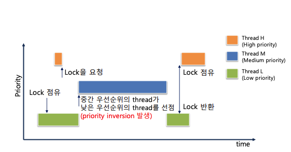
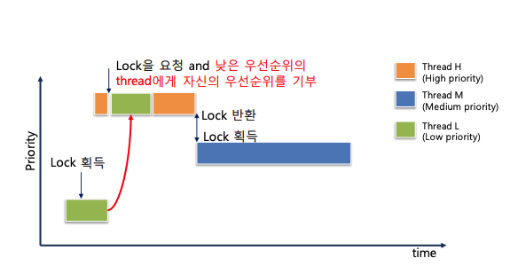
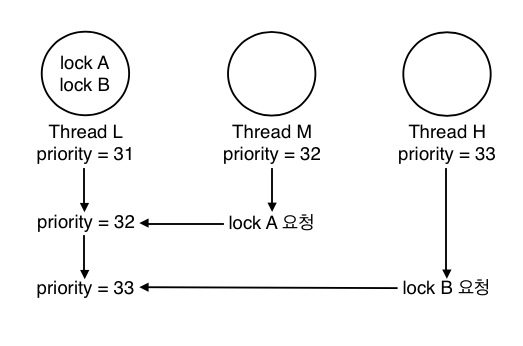
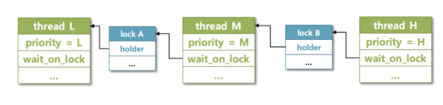
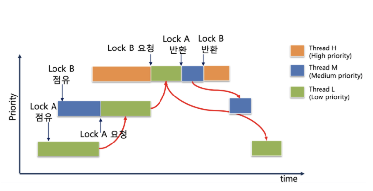

# PintOS 문법 정리 단어장

#

## Semaphores

추상자료형 : Object와 Operation으로 구성됨

앞의 방식들을 추상화 시킴

공유자원을 획득하고 반납하는 것을 Semaphore가 처리해줌

Semaphore S : 정수값(integer variable)을 가질 수 있는데 그것이 자원의 개수라고 생각(즉 S가 5면, 자원이 5개있는것)

P연산은 값을 획득하는 과정이고, V연산은 반납하는 과정

P(S) : while (S≤0)do no-op; //lock을 거는과정

                                   //S값이 0이하인 경우 아무것도 안하고 기다림 자원을 다가져가고 없는 상태니까,

                                  //여기서도 busy wait 문제는 발생함 (계속해서 자원이 없으면 기다리기만하니까)

    s—; // 기다리다가 양수값이되면 자원을 1빼고 획득!

V(S) : S ++; //lock을 푸는 과정

mutex : CS이 1개인것

semaphore : CS이 1개이상 들어갈 수 있다

# Project 1

in thread.h

```c
struct thread {
	/* Owned by thread.c. */
	tid_t tid;                          /* Thread identifier. */
	enum thread_status status;          /* Thread state. */
	char name[16];                      /* Name (for debugging purposes). */
	int priority;                       /* Priority. */

	/* Shared between thread.c and synch.c. */
	struct list_elem elem;              /* List element. */
```

스레드를 위한 구조체 형태

스레드는 구조체의 스택 영역에 존재한다 -> 힙영역으로 커진다.

`struct thread`가 너무 크면 커널 스택을 위한 영역이 없을 것이다. 그래서 몇 바이트 정도의 공간만 가지게 된다. (반드시 1kB 미만으로 잡아준다)

커널 스택도 너무 커지면 안된다. 커널에서 스택 오버플로우가 발생하면 스레드 상태를 변이시킬 가능성이 있다.

그렇기에 커널 함수는 큰 사이즈의 structure나 non-static 지역 변수를 가지면 안된다.

malloc이나 palloc_get_page()같은 동적할당을 활용해야 한다.

---

```c
tid_t tid
```

스레드의 식별자이다.

모든 스레드는 스레드의 수명동안 고유한 식별자를 갖는다.

tid_t는 정수이며, 새로 생기는 스레드는 더 높은 숫자의 tid를 갖게 된다. (ex 1, 2, 3, 4와 같이 오름차순으로 커짐)

type이나 순서 매기는 방식을 변경이 가능하다.

---

```c
enum thread_status status;
```

스레드의 상태를 바꿔주는 녀석

1. THREAD_RUNNING

   - 기동(running) 중.

   - 오직 한 스레드가 주어진 시간동안 기동하고 있다.

   - thread_current()는 현제 기동중인 스레드를 반환한다.

2. THREAD_READY

   - 스레드가 기동할 준비가 되었지만 기동하지 않는 상태

   - 스케줄러에 의해 기동될 수 있다.

   - ready thread는 ready_list라는 이중연결리스트 안에 보관된다.

3. THREAD_BLOCKED

   - 대기(or 일시정지) 중인 상태이다. (ready와는 다름)

   - 이 스레드는 thread_unblock() 으로 상태가 THREAD_READY 로 바뀌기 전에는 스케줄에 할당되지 않는다.

   - 원시적 synchronization 방법이다.

   - Blocked thread가 무엇을 기다리고 있는지 알 수 있는 방법은 없다. (하지만 backtrace가 도움이 될 수도 있다.)

4. THREAD_DYING

   - 다음 스레드가 온다면 스케줄러에 의해 사라질 스레드라는 것을 나타낸다.

---

```c
char name[16]
```

스레드의 이름이나 축약어를 기록하는 부분

---

```c
struct intr_frame tf;
```

문맥 교환(context switching)을 위해 정보를 저장한다.

스택 포인터나 레지스터가 주로 담긴다.

---

```c
struct list_elem elem;
```

스레드를 이중연결 리스트에 넣기 위해서 쓰인다.

이중연결리스트라 하면, ready_list (run을 위해 ready중인 스레드의 리스트), sema_down()에서 세마포어에서 waiting중인 스레드 리스트를 말한다.

이 두 경우에서 쓸 수 있는 이유는 세마포어에 있는 스레드는 ready상태가 될 수 없고, 반대로 ready인 스레드는 세마포어일 수가 없다. 그래서 이 두 리스트에 대해서 같은 list_elem을 사용할 수 있는 것이다.

---

# PintOS Projecvt1 - Thread(스레드) - Priority Inversion(donation)

## Priority Inversion

`priority inversion` 이란 다음과 같은 상황에서 발생한다.

H(high), M(mid), L(low)라는 세 개의 스레드가 있고, 각각의 우선순위가 H > M > L 이라고 해보자.

H가 L을 기다려야 하는 상황(예를 들어, H가 lock을 요청했을 때 이 lock을 L이 점유하고 있는 경우)이 생긴다면 H가 L에게 CPU 점유를 넘겨주면 M이 L보다 우선순위가 높으므로 점유권을 선점하여 실행되어 스레드가 마무리 되는 순서가 H->L->M이 되어서 M이 더 높은 우선순위를 가진 H보다 우선하여 실행되는 문제가 발생한다.



이러한 문제를 해결하기 위한 방법으로 priority donation 을 구현하여야 한다.

`priority donation` 이란 위의 상황에서 H 가 자신이 가진 priority 를 L 에게 일시적으로 양도하여서 H 자신의 실행을 위해 L 이 자신과 동일한 우선순위를 가져서 우선적으로 실행될 수 있도록 만드는 방법이다. `priority donation` 이 작동하면 실행 순서는 아래와 같이 바뀐다.



핀토스 documents 에서는 `priority donation` 이 일어난 수 있는 모든 상황을 고려해야 한다고 하면서 `Multiple donation`, `Nested donation` 두 가지를 언급한다.

## Multiple donation

단어에서 알 수 있듯이 여러번의 donation 이 일어난 상황이라고 볼 수 있다.

위의 예시에서 L 가 lock A, lock B 라는 두 가지 lock 을 점유하고 있다고 해보자.

H 가 lock A 를, M 이 lock B 를 각각 요청하였을 때, L 은 자신이 가지고 있는 lock 을 요청한 모든 스레드에게 priority 를 양도받고, 이 중 가장 높은 priority 를 일시적으로 자신의 priority 로 갖는다. 그림으로 보면 아래와 같다.



이 경우에 L 이 lock B 를 release 해도 아직 M 에게 양도받은 priority 가 있기 때문에 31 이 아닌 32의 priority 를 가지게 된다.

## Nested donation



그림에서 볼 수 있듯이 H 가 lock B 를 얻기 위해 M 에게 priority donation 을 행하고 M 은 lock A 를 얻기 위해 L 에게 priority donation 을 행하는 것 처럼, 여러번의 단계적 donation 이 일어나는 상황이다.



시간에 따라 스레드의 진행 순서는 위와 같다.
