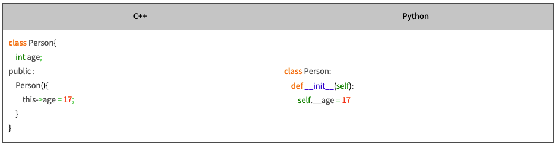
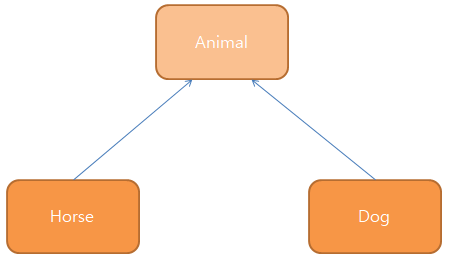

# 클래스와 객체

## 클래스(Class)

클래스와 객체는 길가에서 파는 붕어빵으로 간단히 비유하여 이해할 수 있다.

프로그래머 관점에서는 붕어빵을 찍어낼 수 있는 틀을 클래스(class)라고 이해할 수 있으며, 붕어빵 틀에서 찍혀 나온 붕어빵 하나하나를 `객체(object)`라고 이해할 수 있다.

이처럼 `클래스(class)`란 무언가를 계속 똑같이 찍어낼 수 있는 설계도와도 같은 것을 의미한다.

또한 `객체(object)`란 설계도, 즉 클래스를 바탕으로 찍어낸 제품과도 같은 것을 의미한다.

다음의 예제에서 클래스와 객체를 구분해 보자.

```py
# 예제
1. 영희 / 사람
2. 영철 / 학생
3. 파이썬 / 프로그래밍 언어
4. 코*콜라 1.5L 페트병 / 음료
5. 1997년에 생산된 500원 / 동전
6. 베이지 천 소파 / 소파
7. 검은 가죽 소파 / 소파
```

위의 예제에서 왼쪽은 객체, 오른쪽은 클래스로 볼 수 있다.

클래스와 객체를 배우기 시작함으로써 '절차지향' 프로그래밍을 벗어나 '객체지향' 프로그래밍에 입문한 것이다.

## 클래스의 구성

클래스는 크게 두 가지로 구성된다.

1. 속성
2. 동작

우선 `속성`은 클래스가 가지는 변수들을 의미한다.
예를 들어 은행 계좌에는 잔액, 계좌의 주인, 이자율등이 있다고 치자.

그렇다면 `동작`은 클래스가 할 수 있는 동작들을 의미하고, 은행 계좌에서의 입금, 출금등의 행위가 이에 속한다고 볼 수 있다.

사람을 예로 들면 이름, 나이등이 `속성`, 걷기, 밥먹기등이 `동작`에 해당된다는 것이다.

이처럼 세상에 이미 존재하거나 우리가 만들 무언가에 대해 속성과 동작을 분리해서 분석해보는 습관을 들이면 이후 클래스를 디자인 하는데 훨씬 쉽게 접근할 수 있다.

이러한 사고방식을 기반으로 프로그래밍을 설계하는 것을 `객체 지향 프로그래밍(Object Oriented Programming)`이라고 부른다.

---

# 객체(Object)

하나의 클래스로부터 여러 개의 객체(object)가 생성될 수는 있지만 각각의 객체는 서로 유일(unique)하다는 특징이 있다.

서로 다른 객체는 특별히 선언한 문장이 없는한 서로 완전히 독립적이다.

즉, 내가 한 객체의 A라는 속성을 변경하여도 다른 객체의 A속성값은 변하지 않는다.

> 객체 지향의 개념

1. Abstraction(추상화) - 만들고자 하는 것들의 공통적인 것을 바탕으로 하나로 묶는 것
2. Encapsulation(캡슐화) - 맡은 역할의 수행을 위해 최소한의 외부 접근만을 허용하는 것
3. Polymorphism(다형성) - 자료형에 구애 받지 않고 프로그래밍 하는 것
4. Inheritance(상속) - 하위 개념이 상위 개념의 속성 및 동작 등을 물려받는 것
 

 ---

# 클래스의 선언

파이썬에서 클래스를 선언하는 방법은 다음과 같다.

```py
class Hmoe:
```
클래스는 class 키워드와 함께 만들고자 하는 클래스의 이름을 나열하여 선언한다. 파이썬에서 클래스의 이름은 일반적으로 대문자로 시작한다.

## 생성자(Constructor)의 선언

```py
class Home:
    def __init__(self, area, height, color, xmeter,ymeter):
        self.area = area
        self.height = height
        self.color = color
        self.xmeter = xmeter
        self.ymeter = ymeter
```
우리가 Home 클래스라는 설계도를 얻었다고 가정해보자.

이 설계도를 바탕으로 세상에 실제 Home이 태어나게 해주는 것이 바로 `생성자(constructor)`이다.

파이썬에서 생성자의 이름은 항상 `__init__`으로 고정되며, 다른 이름으로 변경할 수 없다.

또한., 생성자의 첫번째 매개변수는 반드시 `self`로 선언해야 한다.

## self 키워드

클래스 외부에서 해당 함수를 호출한 객체를 찾는 일은 객체의 이름만 알면 쉽게 찾을 수 있다.

하지만 클래스 내부에서 호출한 객체를 찾으려면 마땅한 방법이 없다.

그래서 도입된 것이 바로 `self`키워드 이다.

파이썬에서 self키워드는 해당 함수를 호출한 객체를 가리킨다.

C++과는 다르게 파이썬은 항상 클래스 내부 변수를 미리 선언하지 않고 사용한다.



### private 키워드

private 키워드는 클래스 외부에서 클래스 내부의 멤버에 접근하지 못하도록 하는 키워드로 java나 c++에서 주로 사용한다. 하지만 파이썬에서는 private 키워드를 사용하지 않고, 변수 앞에 (_) 언더스코어 두 개를 붙여서 표현한다.

private 키워드로 설정된 내부 멤버에는 해당 객체 내에서만 접근할 수 있다.

같은 클래스에서 생성된 객체라더라도 서로 다른 객체의 private 멤버에는 접근할 수 없다.

### public 키워드

Public 키워드는 private 키워드와 반대되는 개념으로 클래스 내부나 외부든 어디에서나 접근할 수 있는 멤버들을 의미한다. 파이썬에서는 Private 키워드와 마찬가지로 public 키워드를 사용하지 않고, 변수의 앞과 뒤에 언더스코어( `_` )두 개를 붙여서 표현한다.

대표적인 예가 앞서 살펴본 생성자`__init__`이 해당된다.

---

## 인스턴스 화

클래스에 생성자를 만들었다면 이제 실제로 사용해보자.

```py
#EX
if __name__ == '__main__':
    purgio = Home(32,2.5,'white',101,110)
```

클래스에서는 생성자를 호출하여 객체를 만드는데 이러한 과정을 인스턴스화라고 한다.

이때 생성자 이름인 `__init__`을 호출하는 것이 아닌 클래스 이름을 호출하여 객체를 생성하게 된다.

그리고 생성자의 매개변수 목록과 실제 전달 인수를 순서까지 잘 맞춰 전달해 줘야 한다.

---

## 클래스 변수

앞서 같은 클래스에서 생성된 객체라도 서로 완전히 독립적이라고 했다.

하지만 이러한 객체끼리 정보를 공유하는 방법이 완전히 없는 것은 아니다.

바로 `클래스 변수`라는 것을 사용하면 같은 클래스에서 생성된 객체끼리 정보를 공유할 수 있다.

다음 예제를 통해 어떤식으로 정보가 공유되는지 알아보자.

```py
class Alphabets:
    __str = ""
    def __init__(self, text):
        self.text = text
        Alphabets.__str += text
    def print_class_variable(self):
        print (Alphabets.__str)

if __name__ == '__main__':
    o1 = Alphabets('p') # Alphabets.__str에 p추가
    o2 = Alphabets('y') # Alphabets.__str에 y추가
    o3 = Alphabets('t') # Alphabets.__str에 t추가
    o4 = Alphabets('h') # Alphabets.__str에 h추가
    o5 = Alphabets('o') # Alphabets.__str에 o추가
    o6 = Alphabets('n') # Alphabets.__str에 n추가
 
    # Alphabets 클래스의 Alphabets.__str 객체의 값 = python 완성

    o1.print_class_variable()   # python 출력
    o5.print_class_variable()   # python 출력
```


---

# 상속(Inheritance)

상속(Inheritance)이란?

프로그래밍의 관점에서 보면 말, 개, 고양이, 닭, 등의 공통점은 동물이라는 점이고, 이러한 말, 개, 고양이, 닭 등의 객체가 '동물'이라는 공통점을 상속받았다고 볼 수 있다.




> 예제